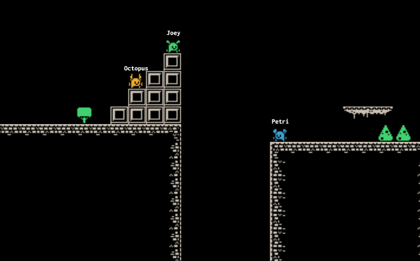

# joeys-games

A collection of games I made using the HTML5 canvas API + JavaScript.

## Platform Party

A real-time multiplayer browser platformer made with the
<a href="https://developer.mozilla.org/en-US/docs/Web/HTML/Element/canvas">canvas scripting API</a>.

## Snake

Classic arcade snake game.

