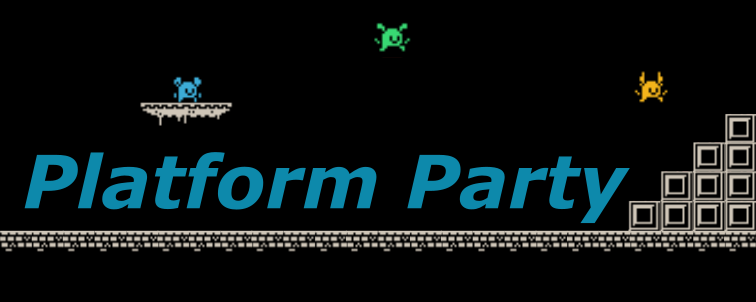

# joeys-games


A collection of games I made using the HTML5 <a href="https://developer.mozilla.org/en-US/docs/Web/HTML/Element/canvas">canvas scripting API</a>.

## Platform Party

A real-time multiplayer browser platformer.

<a href="https://play.joeyshi.xyz/platform-party">
    
</a>



## Snake

Classic arcade snake game.

<a href="https://play.joeyshi.xyz/snake">
    
</a>


## Running with Docker Compose

The snake game stores high scores in a SQLite database file, persisted via a bind mount to `./data`
so it can be backed up directly from the host.

Create a `docker-compose.yml` with the following content:

```yaml
services:
  joeys-games:
    image: ghcr.io/joeyshi12/joeys-games:latest
    ports:
      - "8080:8080"
    volumes:
      - ./data:/data
    restart: unless-stopped
```

Then start it with:

```sh
docker compose up -d
```
