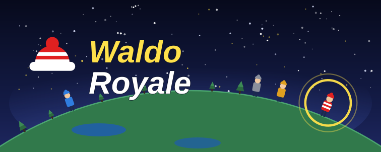

# joeys-games


A collection of games I made using the HTML5 <a href="https://developer.mozilla.org/en-US/docs/Web/HTML/Element/canvas">canvas scripting API</a>.

## Waldo Royale

A GeoGuessr-style multiplayer Where's Waldo.

<p align="center">
    <a href="https://play.joeyshi.xyz/waldo-royale/">
        
    </a>
</p>

## Platform Party

A real-time multiplayer browser platformer.

<p align="center">
    <a href="https://play.joeyshi.xyz/platform-party/">
        
    </a>
</p>

## Snake

Classic arcade snake game.

<p align="center">
    <a href="https://play.joeyshi.xyz/snake/">
        
    </a>
</p>

## Running with Docker Compose

The snake game stores high scores in a SQLite database file, persisted via a bind mount to `./data`
so it can be backed up directly from the host.

Create a `docker-compose.yml` with the following content:

```yaml
services:
  joeys-games:
    image: ghcr.io/joeyshi12/joeys-games:latest
    ports:
      - "8080:8080"
    volumes:
      - ./data:/data
    restart: unless-stopped
```

Then start it with:

```sh
docker compose up -d
```
